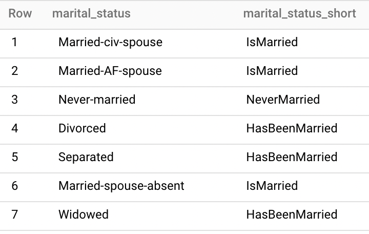

Go to the Google BigQuery Sandbox environment and search for the `bigquery-public-data.ml_datasets.census_adult_income` dataset among the public datasets. Open a query editor and try to answer the following questions using only the clauses and statements seen in class so far.

1. Check the range of the age variable, it goes from 17 to 90 years old; using a CASE-WHEN statement, create a new variable that groups the data in 5 age brackets: “<20“, “20-39“, “40-59“, “60-79“, “>=80“
2. To make sure your statement is working correctly, combine it with a WHERE clause to see if the brackets contain the correct ages (for instance, you could include only age <20 and check that only the bracket “<20” is returned).
3. How many white males are there with a Doctorate in the United States?
4. Is it more or less than the number of white females with a Doctorate in the United States?
5. In the previous question, you should have observed that, in absolute terms, there are almost four times as many males with a doctorate compared to females. But is it really so? Well, in absolute terms it is, however, to get a more accurate picture of our population, we should compare those values to the proportion of total males and females in the population.
6. Find how many males and females there are in the total population.
7. Now, using a calculator or a spreadsheet (or even the BigQuery editor), compare the number of Males with a Doctorate to the total number of Males in the dataset (TotMales / MalesWithDoctorate * 100) and then do the same with the Females. You should find that, although it is true that there are more males with a doctorate than females, compared to the overall proportion of male/female split in the population, it is not really four times as many, but a little less than twice (1.8x). The catch here is that females are underrepresented in this dataset (10.8K females vs 21.8K males).

## Advanced Exercise (optional):
Keep using the `bigquery-public-data.ml_datasets.census_adult_income` dataset and try to answer the following questions using only the clauses and statements seen in class so far.

1. Write a single query that shows the total number of males and females present in the dataset in two separate columns called TotMales and TotFemales, respectively (this is just like question 6 from the previous section, but here the challenge is to write it in a single query).
2. Now, still using a single query, generate a table (2 columns, 1 row) that shows the percent of males and females with a doctorate, compared to their respective base population (males and females). Again, this is like question 7 from the previous section, but this time you’ll perform all the calculations directly in the SELECT part of the query.
3. Finally, in the same query, create a third column called FemMalDocRatio where you divide MalesDocPct by FemalesDocPct and ROUND the three results to the 2nd decimal place (yes, queries can get get long and messy).
4. Now let’s say you’re interested in the same variables from the previous questions, but just for Italy (variable native_country). What is the most efficient way (both computationally as well as requiring the least amount of additional code to be written) to accomplish this?
5. The result from the previous question is drastically different from what we observed in the general population (across all countries). Here it seems like the percent of females with a doctorate are much higher than the average of the general population. Is this result significant? Why?
6. How many people in the dataset respond to all of the following conditions? Which countries are they native of?
   - Work in either Local-gov, Federal-gov or State-gov
   - Have less than 10 years of education
   - Have a positive capital gain
   - And are not native of the United-States
7. Write a CASE-WHEN statement that groups the 7 elements in the variable marital_status into 3 main categories (as per the screenshot below) and call it marital_status_short:

Then, in the same statement, select all variables from the dataset, including the newly created marital_status_short and, using a WHERE clause, keep only people that are married (make sure you use the new variable you just created in the WHERE clause), have a positive capital gain and are of Amer-Indian-Eskimo race from the United States.
How many people are there?

Given the resulting dataset from the previous question, what is the average capital gain of males and females? Write a query that shows those two results in the output table and ROUND them to the closest integer.
